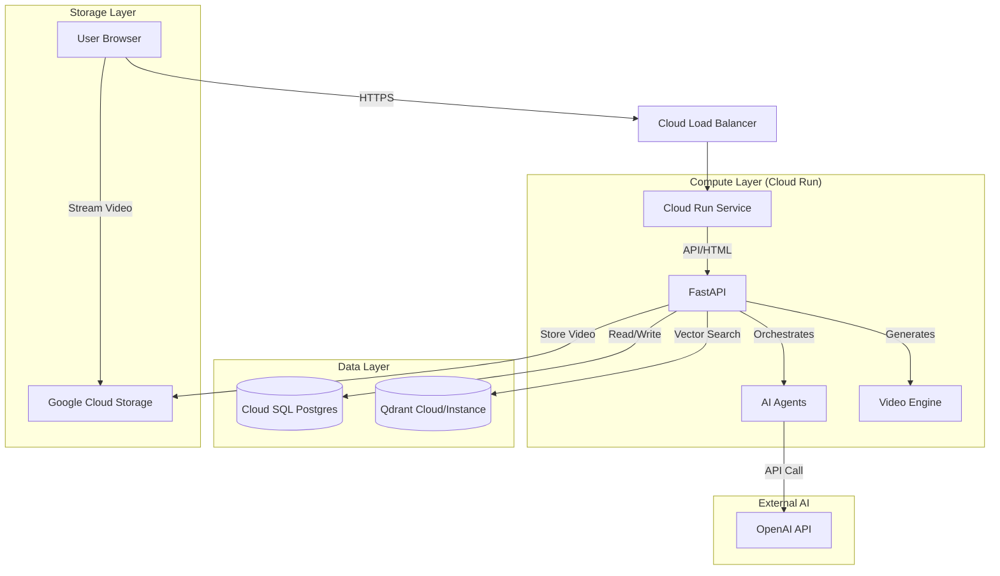

# Project "Go Live" Technical Report

## Executive Summary

This report details the technical architecture, deployment strategy, and critical steps required to take the **AutoGenCourseProject** (Course Generator) significantly from a local development application to a live, production-ready system on Google Cloud Platform (GCP).

The system currently leverages a FastAPI backend, AI agents for content generation, and a local PostgreSQL database. The transition to production will involve containerization, managed cloud services for scalability, and a shift to distributed storage for generated media.

## 1. System Architecture Overview

### 1.1 Technology Stack

*   **Backend Framework**: FastAPI (Python 3.10+)
    *   *Role*: HTTP API, Request Handling, AI Orchestration.
*   **Database**: PostgreSQL 15+ (Production: Cloud SQL)
    *   *Role*: Structured storage for Users, Courses, Modules, Lessons, and Enrollments.
*   **AI & Logic**:
    *   **LLM Interface**: OpenAI API (`gpt-4o-mini`).
    *   **Agent Framework**: AutoGen (AgentManager) for multi-agent workflows.
    *   **Vector Search**: Qdrant (RAG memory & context retrieval).
*   **Media Generation**:
    *   **Video**: MoviePy (Programmatic video editing).
    *   **Images**: Pillow (Image manipulation).
*   **Frontend**:
    *   Server-Side Rendering (SSR) with Jinja2 templates.
    *   Vanilla CSS + JavaScript for interactivity (Course Builder, Dashboard).

### 1.2 Architecture Diagram

## 2. Deployment Strategy

The production environment will utilize **Google Cloud Platform (GCP)** largely for its strong support for containerized serverless applications and managed database services.

### 2.1 Core Infrastructure
*   **Compute**: **Google Cloud Run**.
    *   *Why*: Serverless, scales to zero (costs effectively zero when not in use), handles concurrent requests efficiently, and simplifies container deployment.
*   **Database**: **Cloud SQL for PostgreSQL**.
    *   *Why*: Fully managed, automated backups, high availability.
*   **Storage**: **Google Cloud Storage (GCS)** buckets.
    *   *Why*: Cloud Run has an ephemeral filesystem (files are lost on restart). Generated videos MUST be stored in GCS to be persistent and accessible via public URLs.

### 2.2 Continuous Integration/Deployment (CI/CD)
*   **Tool**: **Google Cloud Build**.
*   **Trigger**: Push to `main` branch.
*   **Process**:
    1.  Build Docker image.
    2.  Push image to Google Artifact Registry.
    3.  Deploy new revision to Cloud Run.
    4.  Run database migrations (`alembic upgrade head`).

## 3. Critical "Go Live" Technical Changes

Before the application can be successfully deployed, the following technical refactors are **mandatory**:

### 3.1 Migration to Cloud Storage (Major Priority)
*   **Current State**: Videos are saved to `course_material_service/static/videos` (local disk).
*   **Issue**: On Cloud Run, this directory is temporary. A user might generate a video, but when they try to view it 5 minutes later, it could be gone if the instance reset.
*   **Solution**: Refactor `course_material_service/video_builder.py` and `routes/generate_course.py`.
    *   Implement a `StorageService` interface.
    *   After `MoviePy` generates the file to `/tmp`, upload it immediately to a GCS bucket (e.g., `gs://autogen-course-assets/videos/`).
    *   Save the **Public URL** (Signed URL or Public Bucket URL) in the database instead of the local filename.

### 3.2 Asynchronous Task Handling
*   **Current State**: Video generation happens inside the HTTP request (using `run_in_threadpool`).
*   **Issue**: Video rendering is CPU-heavy and slow. Cloud Run has a request timeout (default 5 mins). If a video takes 6 minutes, the request fails and the process is killed.
*   **Solution**:
    *   **Phase 1 (MVP)**: Increase Cloud Run timeout to 15-30 minutes (doable via flags).
    *   **Phase 2 (Robust)**: Use **Cloud Tasks** or **Pub/Sub**.
        1.  User clicks "Generate".
        2.  App sends message to Queue.
        3.  A separate "Worker" instance (or the same API with a background processor) picks up the job.
        4.  When finished, it updates the DB status to "Completed".
        5.  Frontend polls for status or uses WebSockets.

### 3.3 Database Connection Pooling
*   **Requirement**: Ensure `SQLAlchemy` is configured with `pool_size` and `max_overflow` appropriate for Cloud Run concurrency to avoid exhausting Cloud SQL connections.

## 4. Operational "How It's Gonna Work"

### 4.1 The User Experience
1.  **Login**: User logs in (Auth state stored in encrypted HTTP-only cookies).
2.  **Course Design**: User interacts with the Course Builder. All changes are saved instantly to the Cloud SQL database.
3.  **Generation**: User clicks "Generate Video".
    *   The browser shows a "Processing..." progress bar.
    *   The backend orchestrates the AI agents to write the script.
    *   The backend renders the video and uploads it to Cloud Storage.
4.  **Playback**: The video player in the dashboard streams the content directly from the global CDN (Cloud Storage) for low latency.

### 4.2 Monitoring & Maintenance
*   **Logs**: All application logs (FastAPI info, Errors) are automatically captured by **Cloud Logging**.
*   **Performance**: **Cloud Trace** will show latency bottlenecks (e.g., if OpenAI API is slow).
*   **Cost Management**: Set up Budget Alerts in GCP billing to prevent unexpected costs from high GPU/CPU usage during video rendering.

## 5. Cost Estimates (Approximate)

WE ARE USING FREE LIMITS OF GOOGLE CLOUD

| Service | Estimated Cost (Low Usage) | Notes |
| :--- | :--- | :--- |
| **Cloud Run** | $0 - $5 / month | Free tier covers 2M requests. Pays for CPU/Time. |
| **Cloud SQL** | ~$10 - $30 / month | Micro instance. The main fixed cost. |
| **Cloud Storage** | < $1 / month | Cheap for storing mp4 files. |
| **OpenAI API** | Usage Based | Depends on `gpt-4o-mini` token count (~$0.15/million input tokens). |
| **Qdrant Cloud** | Free Tier / $25+ | Free tier available for small collections. |

## 6. Next Steps Checklist

- [ ] **Step 1**: Create GCP Project and enable APIs (Run, SQL, Build, Storage).
- [ ] **Step 2**: Create a GCS Bucket for assets.
- [ ] **Step 3**: Refactor code to upload generated videos to GCS.
- [ ] **Step 4**: Provision Cloud SQL PostgreSQL instance and create DB.
- [ ] **Step 5**: Set up `cloudbuild.yaml` for automated deployment.
- [ ] **Step 6**: Deploy and validte end-to-end flow.
